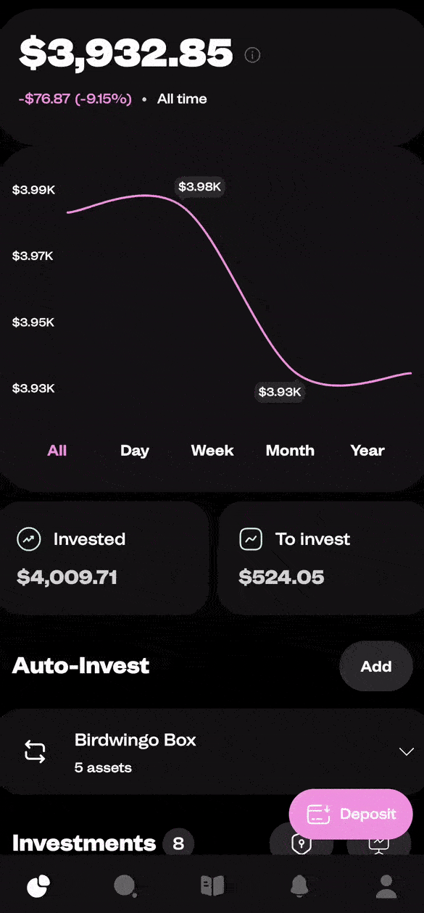

# @birdwingo/react-native-swipe-modal


## Features 🌟

🕶️ Swipe-to-Close Functionality: Easily close modals with a single swipe gesture, providing an intuitive user experience.

🎨 Customizable Appearance: Adjust the color, size, animation, and more to make it blend seamlessly with your application's design.

💃 Smooth Animations: Enjoy smooth and pleasing animations that offer a polished look and feel.

📱 Responsive Design: Adapts to various screen sizes and orientations, ensuring a consistent appearance across devices.

⚙️ Easy Integration: With minimal code, you can have Swipe Modal up and running in your application.

♿ Accessibility Support: Designed with accessibility in mind, allowing all users to interact with the modal effortlessly.

🌍 Cross-Platform Support: Works seamlessly on both iOS and Android, providing a unified experience.

## About

`react-native-swipe-modal` is a customizable and animated modal component that can be used in React Native applications. It provides a smooth swipe-to-close functionality along with various configuration options to suit different use cases. It is used in the [Birdwingo mobile app](https://www.birdwingo.com) to show different kinds of popups and explanations.

<div style="flex-direction:row;">
  
  
</div>

## Installation

```bash
npm install react-native-reanimated
npm install react-native-gesture-handler
npm install @birdwingo/react-native-swipe-modal
```

## Usage

To use the `SwipeModal` component, you need to import it in your React Native application and include it in your JSX code. Here's an example of how to use it:

```jsx
import React, { useRef } from 'react';
import { View, Text } from 'react-native';
import SwipeModal, { SwipeModalPublicMethods } from '@birdwingo/react-native-swipe-modal';


const YourComponent = () => {

  const modalRef = useRef<SwipeModalPublicMethods>(null);

  const showModal = () => modalRef.current?.show(); // Call this function to show modal
  const hideModal = () => modalRef.current?.hide(); // Call this function to hide modal

  return (
    <SwipeModal ref={modalRef}>
      <View>
        <Text>Swipe Modal</Text>
      </View>
    </SwipeModal>
  );

};

export default YourComponent;
```

## Props

 Name                    | Type                          | Default value           | Description       
-------------------------|-------------------------------|-------------------------|---------------------
 `children`              | ReactNode\|ReactNode[]        | **required**            | The content to be rendered inside the modal.
 `bg`                    | string                        | 'black'                 | The background color of the modal.
 `showBar`               | boolean                       | true                    | Set to `true` to display a bar at the top of the modal.
 `barColor`              | string                        | 'grey'                  | The color of the bar at the top of the modal.
 `barContainerStyle`     | ViewStyle\|ViewStyle[]        |                         | Additional styles applied to bar container view.
 `maxHeight`             | 'max'\|'auto'\|number         | 'max'                   | The maximum height of the modal. If `'auto'` maxHeight of modal will the height modal children need.
 `defaultHeight`         | number                        | `maxHeight`             | The default height of the modal.
 `fixedHeight`           | boolean                       | false                   | Set to `true` if you want to maintain a fixed height for the modal. It means that the height of the modal will get back to the initial position after swipe, if modal was not closed .
 `style`                 | ViewStyle\|ViewStyle[]        |                         | Additional styles to be applied to the modal.
 `closeTrigger`          | 'swipeDown'\|'minHeight'      | 'swipeDown'             | The trigger to close the modal. `'swipeDown'` means that modal will close when modal was swiped down by `closeTriggerValue`. `'minHeight'` means that modal will close when height of modal is less than `closeTriggerValue`.
 `closeTriggerValue`     | number                        | 10                      | The value that triggers the modal to close when using the `closeTrigger`.
 `scrollEnabled`         | boolean                       | false                   | Set to `true` if you want the modal content to be scrollable.
 `scrollContainerStyle`  | ViewStyle\|ViewStyle[]        |                         | Additional styles to be applied to the scrollable container.
 `scrollContainerProps`  | ScrollView['props']           |                         | Additional props to be passed to the internal ScrollView component.
 `headerComponent`       | ReactNode                     |                         | A custom component to be displayed at the top of the modal. It's placed above scroll content
 `footerComponent`       | ReactNode                     |                         | A custom component to be displayed at the bottom of the modal. It's placed under scroll content
 `disableSwipe`          | boolean                       | false                   | Set to `true` if you don't want allow gesture.
 `visible`               | boolean                       | false                   | Default value for modal visibility. It can be changed dynamically using public methods.
 `onShow`                | () => void                    |                         | A callback function that will be triggered when the modal is shown.
 `onHide`                | () => void                    |                         | A callback function that will be triggered when the modal is hidden.
 `closeOnEmptySpace`     | boolean                       | true                    | Set to `true` to close the modal when the user taps outside the modal's content.
 `closeOnPressBack`      | boolean                       | true                    | Set to `true` to close the modal when the user presses the back button (Android only).
 `animationDuration`     | number                        | 300                     | The duration of the modal's opening and closing animations, in milliseconds.
 `closeSpaceVisibility`  | number (0 - 1)                | 0.6                     | A number representing the opacity of empty space, that will close the modal if `closeOnEmptySpace` is enabled.
 `topOffset`             | number                        | 0                       | Determines the amount of space that the swipeable content will be offset from the top edge of window.
 `containerProps`        | ViewProps                     |                         | Additional props to be applied to the container.
 `hideKeyboardOnShow`    | boolean                       | true                    | Set to `true` if you want to hide keyboard on show modal if was opened.
 `wrapInGestureHandlerRootView`| boolean                 | false                   | Set to `true` if you want to wrap content in to GestureHandlerRootView (required if you want to use modal inside react-native Modal component).
 `useKeyboardAvoidingView`| boolean                      | true                    | Set to `false` if you want to show keyboard over the modal content.
 `keyboardAvoidingViewBehavior`| 'height' | 'position' | 'padding'| Platform.OS === 'ios' ? 'height' : undefined| Behavior property for keyboardAvoidingView
 `keyboardAvoidingViewProps` | KeyboardAvoidingViewProps | | Additional props to be applied to the KeyboardAvoidingView.

## Public Methods

Name                  | Description
----------------------|--------------
`show`                | Call this method to show the modal.
`hide`                | Call this method to hide the modal.

## Sponsor

**react-native-swipe-modal** is sponsored by [Birdwingo](https://www.birdwingo.com).\
Download Birdwingo mobile app to see react-native-swipe-modal in action!